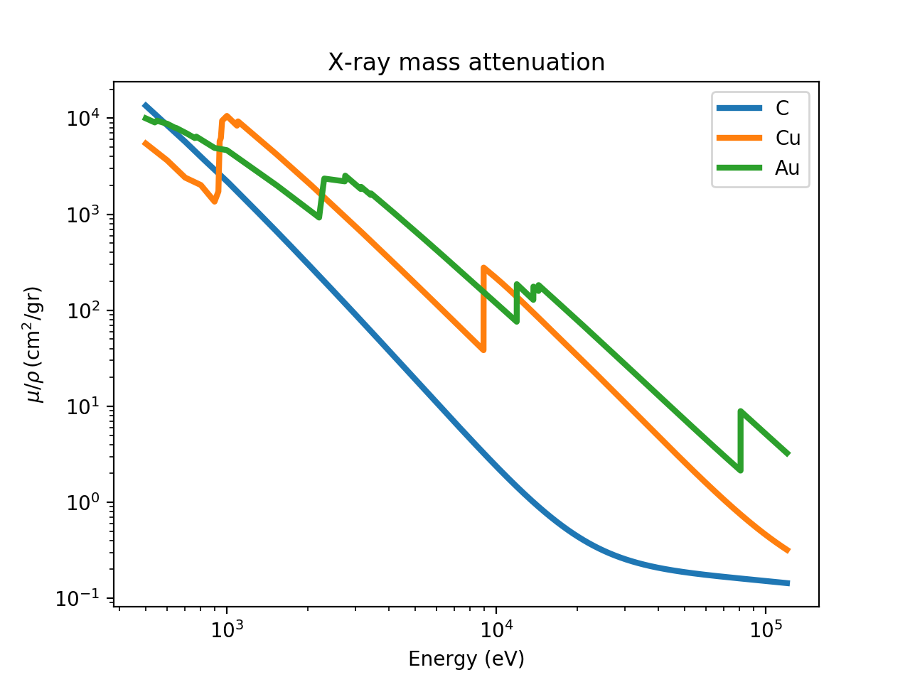
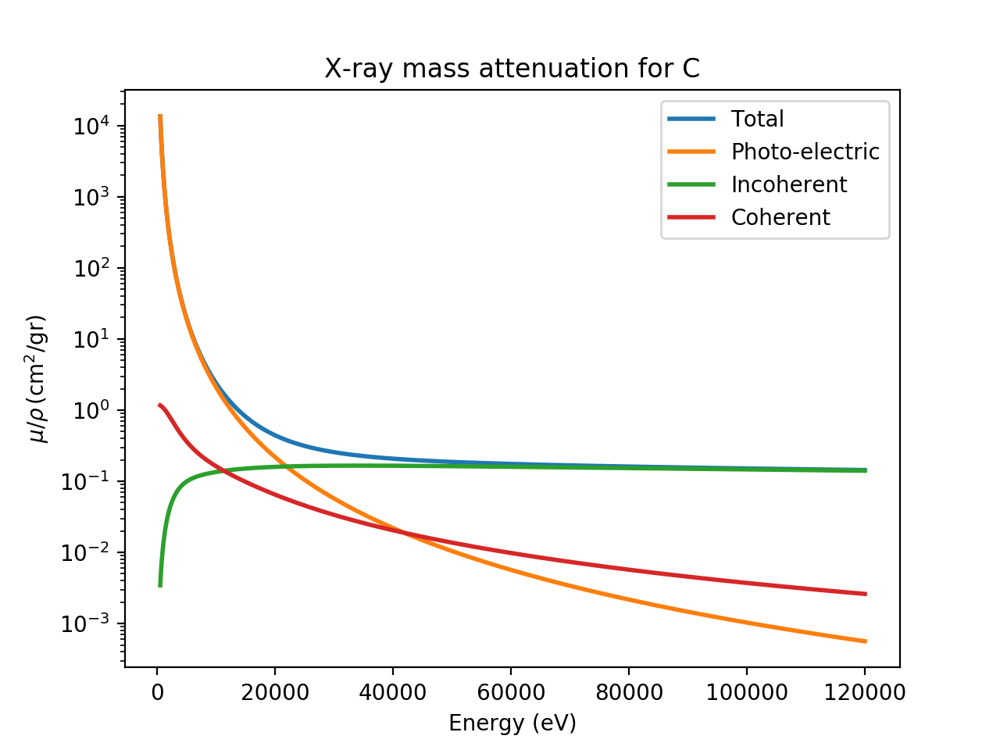
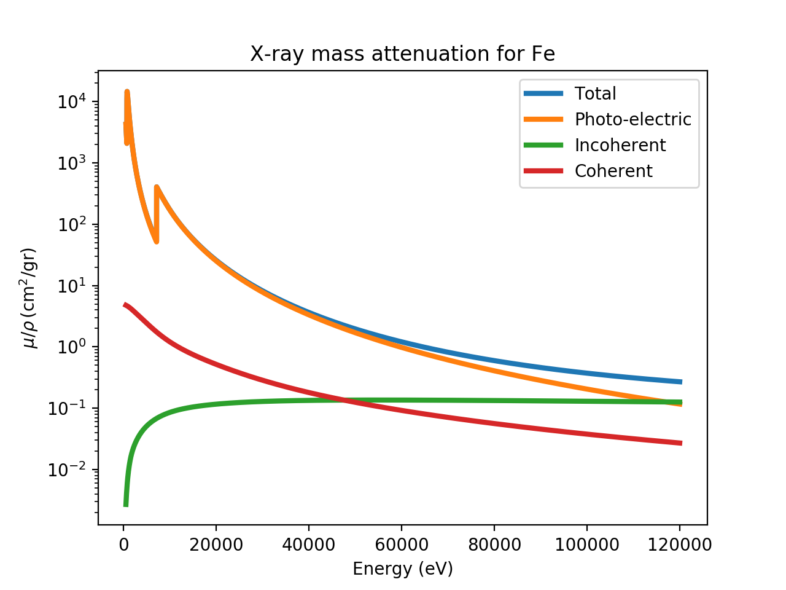
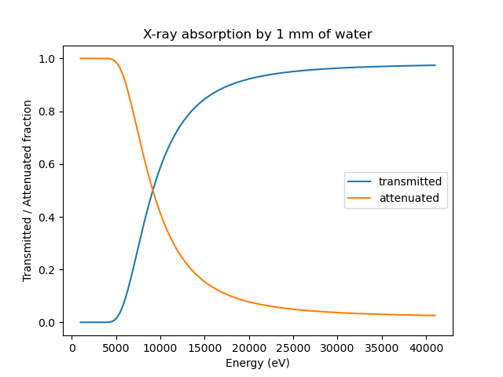
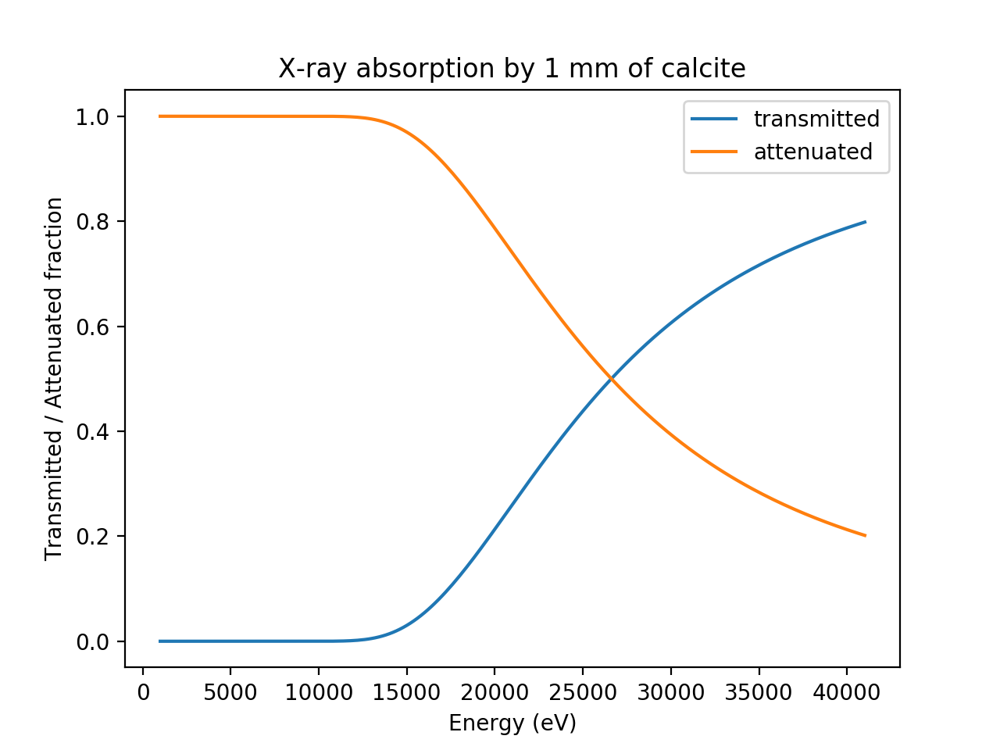
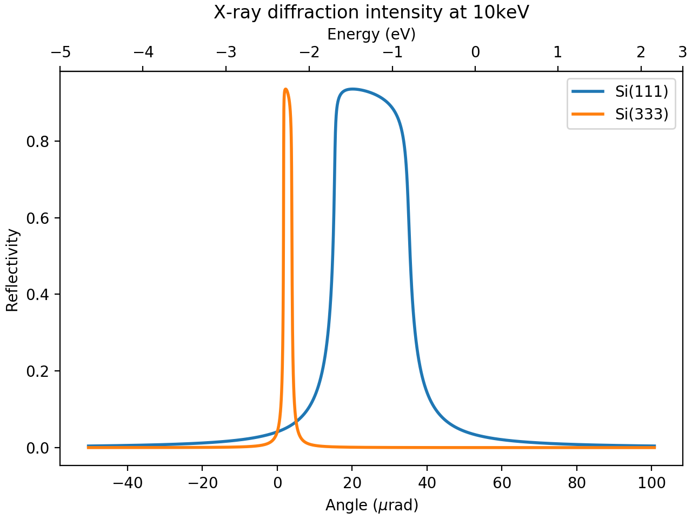

.. _example_calcs:

Example Calculations of X-ray properties of materials
=========================================================

.. module:: xraydb
   :noindex:

Here, a few detailed examples of using the `xraydb.sqlite` to calculate the
X-ray properties of materials are shown.  These all use the functions in
the python `xraydb` module, which is describe in more detail in the next
chapter, :ref:`python_api`.  The examples will explore some aspects of
X-ray physics, but will not give a complete tutorial on the concepts here.
For reference see :cite:`AlsNielson_McMorrow2011` for example.

X-ray attenuation by elements
-----------------------------------------------

The XrayDB database tabulates values of the X-ray mass attenuation
coefficient, :math:`\mu/\rho`, for each element.  In most of the X-ray
regime used in materials characterization (say, up to 150 keV), the
photo-electric effect is the main process that causes X-ray attenuation.
When the photo-electric process is dominant, the values for
:math:`\mu/\rho` depends strongly on *Z* of the atom and on X-ray energy
*E*.  In addition to these strong dependencies, sharp increases --
so-called absorption edges -- with be see at energies of bound core
electron levels of atoms.  To illustrate these characteristics, the
following script will plot :math:`\mu/\rho` for selected elements:
      
.. literalinclude:: ../python/examples/mu_elements.py

.. _fig_mu_depth:

    X-ray mass attenuation coefficient for C, Cu, and Au.

As you can see in Figure from this figure, the attenuation drops very
strongly with :math:`E` -- approximately as :math:`E^3`. :math:`\mu` also
depends strongly with *Z*, though the sharp absorption edges make this more
complicated.

You can also observe that at relatively high energies for relatively low-Z
elements (such as C above about 20 keV) that the attenuation levels off.
This is because the coherent (Rayleigh) and incoherent (Compton) scattering
processes dominate, so that the photo-electric absorption is no longer the
dominant X-ray scattering process.  This can be illustrated by plotting the
different components of :math:`\mu/\rho` for C, as with the following script:

.. literalinclude:: ../python/examples/mu_components_C.py

which will generate the following plot:

.. _fig_mu_components_C:

    X-ray scattering and attenuation factors for C.

Note that above 20 keV, the photo-electric absorption and incoherent
Compton contributions are about equal, and that the Compton scattering
dominates above 50 keV.  As shown above, the photo-electric scattering will
be much higher for heavier elements. The Rayleigh and Compton scattering
have a much weaker dependence on *Z*, so that the photo-electric process
dominates to higher energies.  Replacing 'C' with 'Fe' in the script above
will generate the following plot:

.. _fig_mu_components_Fe:

    X-ray scattering and attenuation factors for Fe.
    
which shows that the Compton scattering reaching about 0.1 to 0.25
:math:`\rm cm^2/gr` for Fe, about the same value as it was for C, while the
photo-electric cross-section dominates past 100 keV.
    
:math:`\mu` calculations for materials
------------------------------------------

While one can use the above values for :math:`\mu/\rho` to calculate the
attenuation of X-rays by multi-element materials, the :func:`material_mu`
function is available to do the more convenient calculation of the X-ray
absorption coefficient :math:`\mu` in units of 1/cm for a material and
energy value and density (which are known for several common materials).
This gives the length for which X-ray intensity is reduced by a factor of
*e*, and so can be used to calculate the fraction of the X-rays transmitted
through a material of known thickness, as :math:`\exp(-t\mu)` for a
material of thickness *t*.  As a first example, we calculate the the
fraction of X-ray transmitted through 1 mm of the water as a function of
X-ray energy:

.. literalinclude:: ../python/examples/mu_water.py

.. _fig_mu_water:

    Fraction of X-rays absorbed and transmitted by water

replacing::

    mu = material_mu('H2O', energy)

with::
  
    mu = material_mu('CaCO3', energy, density=2.71)

would generate the following plot

.. _fig_mu_calcite:

    Fraction of X-rays absorbed and transmitted by calcite

    
For many X-ray experiments, selecting the size of a material size so that
its thickness is approximately 1 to 2 absorption length is convenient so
that X-ray scattering and emission can be observed strongly, with neither
all primary and scattered X-rays being absorbed by the material itself, but
also not simply passing through the material without any interaction.  For
example, one can simply do::

  >>> from xraydb import material_mu
  >>> mu_20kev = xraydb.material_mu('CaCO3', 20000, density=2.71)
  >>> print("CaCO3 1/e depth at 20keV = {:.3f} mm".format(10/mu_20kev))
  CaCO3 1/e depth at 20keV = 0.648 mm

    

Ionization chamber calculation of X-ray flux
----------------------------------------------------

A gas-filled ionization chamber is a widely used form an X-ray detector,
used because it is simple, cheap, and can absorb a fraction of an incident
X-ray beam and be linear in estimating the photon flux over many orders of
magnitude.  X-rays entering a chamber filled with an inert gas (often a He,
N2, or one of the noble gases, or a mixture of two of these) will be
partially absorbed by the gas, with the strong energy dependence shown
above.  The absorption will *ionize* the gas, generating free electrons and
energetic ions.  In fact, the first ionization will generate an
electron-ion pair with the energy of the X-ray minus the binding energy of
the core electron, but the high-energy electron and ion will further ionize
other gas molecules.  With an electric potential (typically on the order of
1 kV /cm) across the chamber, a current can be measured that is
proportional to the X-ray energy and fluence of the X-rays.

The process of converting the photo-current into X-ray fluence involves
several steps. First, the energy from a single X-ray generates a number of
electron-ion pairs given by the *effective ionization potential* of the
gas.  These are reasonably well-known values (see :cite:`Knoll2010`) that
are all between 20 and 40 eV, given in the
:ref:`Table of Effective Ionization Potentials <xray_ionpot_table>`.

.. index:: Table of Effective Ionization Potentials
.. _xray_ionpot_table:

   Table of Effective Ionization Potentials. Many of these are taken from
   :cite:`Knoll2010`, while others appear to come from International Commission
   on Radiation Units & Measurement, Report 31, 1979.  The names given are
   those supported by the functions :func:`ionization_potential` and
   :func:`ionchamber_fluxes`. 

           +--------------------+----------------+
           | gas name(s)        | potential (eV) |
           +====================+================+
           | hydrogen, H        |   36.5         |
           +--------------------+----------------+
           | helium, He         |   41.3         |
           +--------------------+----------------+
           | nitrogen, N, N2    |   34.8         |
           +--------------------+----------------+
           | oxygen, O, O2      |   30.8         |
           +--------------------+----------------+
           | neon, Ne           |   35.4         |
           +--------------------+----------------+
           | argon, Ar          |   26.4         |
           +--------------------+----------------+
           | krypton, Kr        |   24.4         |
           +--------------------+----------------+
           | xenon, Xe          |   22.1         |
           +--------------------+----------------+
           | air                |   33.8         |
           +--------------------+----------------+
           | methane, CH4       |   27.3         |
           +--------------------+----------------+
           | carbondioxide, CO2 |   33.0         |
           +--------------------+----------------+
                 

From this, we can see that the absorption of 1 X-ray of energy 10 keV will
generate about 300 electron-ion pairs.  That is not much current, but if
:math:`10^8 \,\rm Hz` are absorbed per second, then the current generated
will be around 5 nA.  Of course, the thickness of the gas or more
importantly the length of gas under ionizing potential will have an impact
on how much current is generated.  The photo-current will then be amplified
and converted to a voltage using a current amplifier, and that voltage will
then recorded by a number of possible means.  Note that while the ion
chamber itself will be linear over many orders of magnitude of flux
(provided the potential between the plates is high enough), a current
amplifier at a particular setting of sensitivity will be linear only over a
couple orders of magnitude (typically between output voltage of 0.05 to 5
V).  Because of this, the sensitivity of the ion chamber current amplifier
needs careful attention.

The function :func:`ionchamber_fluxes` will help generate X-ray fluxes
associated with an ion chamber and help handle all of these subtle issues,
using the following inputs:

  * `gas`: the gas, or mixture of gases, used.
  * `length`: the length of the ion chamber, in mm.
  * `energy`: the X-ray energy, in eV.
  * `volts`: the output voltage of the current amplifier
  * `sensitivity` and `sensitivity_units`: the sensitivity or gain of the
    amplifier used to convert the photo-current to the recorded voltage.

The default `sensitivity_units` is 'A/V' but can be set to any of the
common SI prefixes such as 'p', 'pico', 'n', 'nano', :math:`\mu`
(`'\\u03bc'`), 'u', 'micro', 'm', or 'milli', so that::

  
    >>> fluxes = ionchamber_fluxes('N2', volts=1, energy=10000, length=100,
                                   sensitivity=1.e-9)
    >>> fluxes = ionchamber_fluxes('N2', volts=1, energy=10000, length=100,
                                   sensitivity=1, sensitivity_units='nA/V')

will give the same results.

The output from  :func:`ionchamber_fluxes` is a named tuple with 3 fiels:

  * `photo`  -  the flux absorbed by the photo-electric effect, in Hz.
  * `incident` - the flux incident on the ion chamber, in Hz.
  * `transmitted` - the flux beam leaving the ion chamber, in Hz.

Note that the ion chamber current is generated only by the photo-electric
effect, which dominates for heavy elements and relatively low X-ray
energies, but does not necessarily dominate at high X-ray energies for
gases such as helium, nitrogen which are often used in ion chambers.  The
coherent and incoherent scattering processes are included in the
calculations done in :func:`ionchamber_fluxes` so that estimated incident
flux from the measured current can be somewhat larger than if only the
photo-electric effect was considered.

As an example calculation of ion chamber currents::
  
   >>> fluxes = ionchamber_fluxes(gas='nitrogen', volts=1.25, energy=18000,
                                  length=100.0, sensitivity=1.e-6)
   >>> print("Incident flux= %g Hz" % fluxes.incident)
   Incident flux= 1.1632e+11 Hz
   >>> print("Downstream flux= %g Hz" % fluxes.transmitted)
   Incident flux= 1.1632e+11 Hz
   >>> print("Downstream flux= %g Hz" % fluxes.transmitted)
   Downstream flux= 1.05463e+11 Hz

   >>> print("Absorbed Photo flux= %g Hz" % fluxes.photo)
   Absorbed Photo flux= 7.54182e+09 Hz
   >>> print("Scattered flux= %g Hz" % (fluxes.incident - fluxes.transmitted - fluxes.photo))
   Scattered flux= 3.31569e+09 Hz

As for the example for carbon above, the non-photo-electric effects are not
negligible for nitrogen at 18 keV.

It is not uncommon for an ion chamber to be filled with a mixture of 2 or
more gases so as to better control the fraction of X-rays absorbed in a
chamber of fixed length. This can be specified by passing in a dictionary
of gas name and fractional density, as with::

   >>> fluxes = ionchamber_fluxes(gas={'N2':0.75, 'Ar': 0.25}, volts=1.25,
                                  energy=18000, length=100,
                                  sensitivity=0.2, sensitivity_units='microA/V')
   >>> "%g" % fluxes.incident
   '1.77786e+10'

Finally, the pressure of the gas is sometimes adjusted to alter the
fraction of the beam absorbed.  The calculations here all use the densities
at STP, but changes in gas density will be exactly linear to changing the
length of the ion chamber.

X-ray mirror reflectivities
-------------------------------------------

At very shallow angles of incidence X-rays can be reflected by total
external reflection from a material. The reflectivity can be very high
at relatively low energies and shallow angles, but drops off dramatically
with increasing energy, increasing angle, and decreasing electron density.
Still, this reflectivity is one of the few ways to steer X-ray beams and so
is widely used in synchrotron radiation sources.

The reflectivity can be calculated with the :func:`mirror_reflectivity`
function which takes X-ray energy, incident angle, and mirror material as
arguments.

An example script, comparing the energy-dependence of the reflectivity for
a few common mirror materials is given as

.. literalinclude:: ../python/examples/mirror_comparison.py

.. _fig_mirrors:

.. figure::  _images/mirrors.png
    :target: _images/mirrors.png
    :width: 75%
    :align: center

    X-ray mirror reflectivity at :math:`\theta = 2\mathrm{mrad}` for
    selected mirror surfaces and coatings used for mirrors.

Darwin widths of monochromator crystals
-------------------------------------------

Bragg's law describes X-ray diffraction from crystals as

.. math::
    m \lambda = 2 d \sin(\theta)

where :math:`\lambda` is the X-ray wavelength, :math:`d` the d-spacing of
the crystal lattice plane, :math:`\theta` the incident angle, and :math:`m`
the order of the reflection.  For imperfect crystals, in which the lattice
planes are not stacked perfectly over extended distances, the angular width
of any particular reflection is dominated by the spread in d-spacing and
the mosaicity inherent in the crystal.  For perfect crystals, however, the
angular width of a reflection is dominated by the fact that effectively all
of the X-rays will scatter from the lattice well before any attenuation of
the X-ray beam occurs. This *dynamical* diffraction gives a finite angular
width to reflection usually called the Darwin width (named for
Charles G. Darwin, grandson of the more famous Charles R. Darwin).  In
addition, the refraction and absorption effects that give anomalous
scattering (as calculated with :func:`xray_delta_beta`) give non-symmetric
attenuation of this reflectivity.

All of these effects are included in the :func:`darwin_width` function,
which takes inputs of

  * `energy`: the X-ray energy, in eV.
  * `crystal`: the atomic symbol for the crystal: 'Si', 'Ge', or 'C'. ['Si']
  * `hkl`: a tuple with (h, k, l) of the reflection used. [(1, 1, 1)]
  * `m`: the order of the reflection. [1]

As with :func:`ionchamber_fluxes`, the output here is complicated enough
that it is put into a named `DarwinWidth` tuple that will contain the
following fields:

   * `theta` - the nominal Bragg angle, in rad
   * `theta_fwhm` - estimated angular Darwin width, in rad
   * `energy_fwhm` - estimated energy Darwin width, in eV
   * `zeta` -  nd-array of :math:`\zeta = \Delta\lambda/\lambda`.
   * `dtheta`  - nd-array of angles around from Bragg angle, in rad
   * `denergy` -  nd-array of energies around from Bragg energy, in eV
   * `intensity` - nd-array of reflected intensity at `zeta` values.

Here, `dtheta` will be given by :math:`\delta\theta = \zeta \tan(\theta)`,
and `denergy` will be given by :math:`\delta{E} = \zeta E`.  All of the
nd-arrays will be the same size, so that plots of reflectivity can be
readily made.  An example usage, printing the predicted energy and angular
widths and plotting the intensity profile or "rocking curve" is 

.. literalinclude:: ../python/examples/darwin_widths.py
		    
which will print out values of::

  Darwin Width for Si(111) at 10 keV: 20.84 microrad, 1.03 eV
  Darwin Width for Si(333) at 10 keV: 2.32 microrad, 0.11 eV

and generates a plot of

.. _fig_darwin:

    X-ray monochromator diffracted intensities around the Si(111)
    reflection.
    

Note here that the width of the 3rd harmonic peak is specified not as the
Si (3, 3, 3) peak, but as the (1, 1, 1) peak with m=3, as we want to ensure
that the Bragg angle used is for the (1, 1, 1) reflection.
