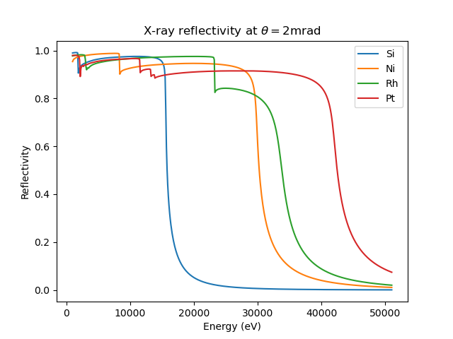

.. _example_calcs:

Example Calculations of X-ray properties of materials
=========================================================

While the reference documentaion above describes how to call the `xraydb`
functions, here we give more detailed examples of using the functions to
calculate the X-ray properties of materials.  The basics of the X-ray
physics will not be reviewed here - see, for example,
:cite:`AlsNielson_McMorrow2011` for more details.

:math:`\mu` calculations
-----------------------------------

The absorption calculations from :func:`material_mu` returns the
attenuation or X-ray absorption coefficient :math:`\mu` for a material and
energy value.  This can be can used to calculate the :math:`1/e` length for
X-rays in a material, or what fraction of the X-rays are transmitted
through a material of known material.  As an example, we calculate the
the fraction of X-ray transmitted through 1 mm of the water as a function
of X-ray energy:

.. literalinclude:: ../python/examples/mu_water.py

.. _fig_mu_depth:

.. figure::  images/mu_water.png
    :target: images/mu_water.png
    :width: 75%
    :align: center

    Fraction of X-rays absorbed and transmitted by water

Ion chamber calculation of X-ray flux
----------------------------------------

X-ray mirror reflectivities
-------------------------------------------

At very shallow angles of incidence X-rays can be reflected by total
external reflection from a material. The reflectivity can be very high
at relatively low energies and shallow angles, but drops off dramatically
with increasing energy, increasing angle, and decreasing electron density.
Still, this reflectivity is one of the few ways to steer X-ray beams and so
is widely used in synchrotron radiaion sources.

The reflectivity can be calculated with the :func:`mirror_reflectivity`
function which takes X-ray energy, incident angle, and mirror material as
arguments.

An example script, comparing the energy-dependence of the reflectivity for
a few common mirror materials is given as

.. literalinclude:: ../python/examples/mirror_comparison.py

.. _fig_mirrors:

    X-ray mirror reflectivity at :math:`\theta = 2\mathrm{mrad}` for
    selected mirror surfaces and coatings used for mirrors.

Darwin widths of monochromator crystals
-------------------------------------------

Bragg's law describes X-ray diffraction from crystals as

.. math::
    m \lambda = 2 d \sin(\theta)

where :math:`\lambda` is the X-ray wavelength, :math:`d` the d-spacing of
the crystal lattice plane, :math:`\theta` the incident angle, and :math:`m`
the order of the reflection.  For imperfect crystals, in which the lattice
planes are not stacked perfectly over extended distances, the angular width
of any particular reflection is dominated by the spread in d-spacing and
the mosaicity inherent in the crystal.  For perfect crystals, however, the
angular width of a reflection is dominated by the fact that effectively all
of the X-rays will scatter from the lattice well before any attenuation of
the X-ray beam occurs. This *dynamical* diffraction gives a finite angular
width to reflection usually called the Darwin width (named for
Charles G. Darwin, grandson of the more famous Charles R. Darwin).  In
addition, the refraction and absorption effects that give anomalous
scattering (as calculated with :func:`xray_delta_beta`) give non-symmetric
attenuation of this reflectivity.  All of these effects are included in the
:func:`darwin_width` function.  As with :func:`ionchamber_fluxes`, the
output here is complicated enough that it is put into a named tuple.  The
estimated FWHM (full-width at half maximum) of the reflection angle (in
radians) and energy spread (in eV) are both available, as are the reflected
intensity in angle and energy around the Bragg peak.  Due to the dynamical
scattering effects, these will not be exactly centered at
:math:`\delta\theta` of 0.  An example usage, printing the predicted energy
and angular widths and plotting the intensity profile or "rocking curve"
is given in:

which generates a plots of

Note here that the width of the 3rd harmonic peak is specified not as the
Si (3, 3, 3) peak, but as the (1, 1, 1) peak with m=1.
